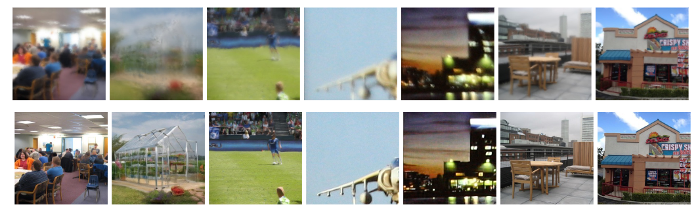
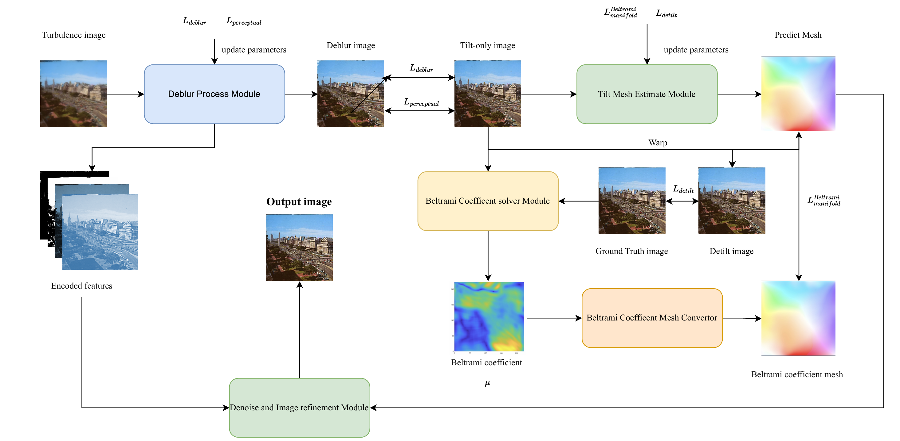

<figure>
    
    <figcaption>Results of the proposed single-frame turbulence restoration algorithm. Input image from heat-chamber and ATSyn-static dataset (top) and the restored images by our porposed TurbWNet (bottom).</figcaption>
</figure>


## Environment
1. cuda>=12 (not necessary)
2. GPU memory>=12G
3. pytorch>=2.0.1

## Dataset
The dataset is generated based on ATSyn-static dataset. Our dataset includes mesh data generated based on manifold computation additionally, which can be better used to supervise tilted networks and achieve better convergence results. The dataset can be obtained from [here](https://pan.baidu.com/s/11VRvbfBKtsUpVnTKDeFO6w?pwd=ysfg).
Also, the manifold mesh can be generated by [code](https://github.com/whuluojia/ImTurb).

## Optional Prepare
The ViT model used in PerceptuallLoss is original from the [MAE repo](https://github.com/facebookresearch/mae), which can also be download by click [here](https://dl.fbaipublicfiles.com/mae/pretrain/mae_pretrain_vit_base.pth).

## Quick Start
1. conda create -n your_name python==3.12
2. conda activate your_name
3. conda install pytorch torchvision torchaudio pytorch-cuda=12.1 -c pytorch -c nvidia
4. pip install -r requirement.txt

## How To Train
- Refer to `./options/train` for the configuration file of the model to train.
<!-- - Preparation of training data can refer to [this page](https://github.com/XPixelGroup/BasicSR/blob/master/docs/DatasetPreparation.md). ImageNet dataset can be downloaded at the [official website](https://image-net.org/challenges/LSVRC/2012/2012-downloads.php).
- The training command is like -->
For multi GPUs, the training comand is like:
```
CUDA_VISIBLE_DEVICES=0,1,2,3,4,5,6,7 python -m torch.distributed.launch --nproc_per_node=8 --master_port=1231 Wnet/train.py -opt ./options/train/turbulence_deblur.yml --launcher pytorch
```

For single GPU, the training command is like:
```
python Wnet/train.py -opt ./options/train/turbulence_deblur.yml
```

The training logs and weights will be saved in the `./experiments` folder.

## Resource consuption
1. Deblur and Detilt task
- Note that the default batch size per GPU is 4, which will cost about 16G memory for each GPU.
2. Deturb tasl
- Note that the default batch size per GPU is 1, which will cost about 16G memory for each GPU.

## Network Structure

<figure style="display: inline-block; text-align: center;">
    
</figure>

Deblur Process Module is a U-Net structure that enhances the clarity of the oblique image. Tilt Field Estimate Module is another U-Net structure that calculates the U and V offsets for each pixel in the camera coordinate system. Noise Reduction and Image Refinement Module is a decoder structure that further improves image quality. The Deblur Process Module produces a clearer oblique image, while the Tilt Field Estimation  Module generates a map of pixel offsets. These encoded features from the Deblur Process Module are then warped according to the Tilt Field and fed into the Noise Reduction and Image Refinement module for final processing.

<figure style="display: inline-block; text-align: center;">
    
</figure>
This is a more detailed version of the network architecture design diagram. The encoder and decoder for downsampling and upsampling can be set to NAFNET/mamba/transformer and other kind for different task. In our paper, transformer encoder and decoder presented the best performence. However, if you want to faster inference or consume less resources, NAFNET and mamba could be better choice.